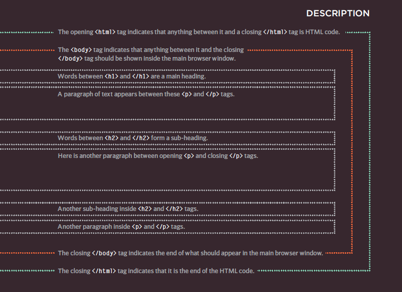

# Understanding structure

### HTML Uses Elements to Describe the Structure of Pages
*Let's look closer at the code from the last page.There are several different elements. Each element has an opening tag and a closing tag.*

*Tags act like containers. They tell you something about the information that lies between their opening and closing tags.*

*Attributes provide additional information about the contents of an element. They appear on the opening tag of the element and are made up of two parts: a name and a value, separated by an equals sign.*

## *For example*

-< p lang="en-us">Paragraph in English< /p>

-< p lang="fr">Paragraphe en Français< /p>

# Body, Head & Title

-< body> You met the < body> element in the first example we created.  Everything inside this element is shown inside the main browser window.

-< head> Before the < body> element you will often see a < head> element. This contains information about the page (rather than information that is shown within the main part of the browser window that is highlighted in blue on the opposite page). You will usually find a < title> element inside the < head> element.

-< title> The contents of the < title> element are either shown in the top of the browser, above where you usually type in the URL of the page you want to visit, or on the tab for that page (if your browser uses tabs to allow you to view multiple pages at the same time).

# Summary structure 

-HTML p XX ages are text documents.
-HTML uses tags (characters that sit inside angled (brackets) to give the information they surround special
meaning.
-Tags are often referred to as elements.
-Tags usually come in pairs. The opening tag denotes the start of a piece of content; the closing tag denotes
the end.
-Opening tags can carry attributes, which tell us moreabout the content of that element.
-Attributes require a name and a value.
-To learn HTML you need to know what tags areavailable for you to use, what they do, and where they
can go.

# DOCTYPES

*Because there have been several versions of HTML, each web page should begin with a DOCTYPE declaration to tell a browser which version of HTML the page is using (although browsers usually display the page even if it is not included). We will therefore be including one in each example for the rest of the book.

# Comments in HTML 
*< !-- --> If you want to add a comment to your code that will not be visible in the user's browser, you can add the text between these characters:*
# < !-- comment goes here -->

# ID Attribute 
*Every HTML element can carry the id attribute. It is used to
uniquely identify that element from other elements on the page. Its value should start with a letter or an underscore (not a number or any other character). It is important that no two elements on the same page have the same value for their idattributes (otherwise the value is no longer unique).*

# HTML5 Layout 17

## HTML5 is introducing a new set of elements that help define the structure of a page.

-The new HTML5 layout elements and their uses.
-How they offer helpful alternatives to the < div> element.
-How to ensure older browsers recognize these elements.

