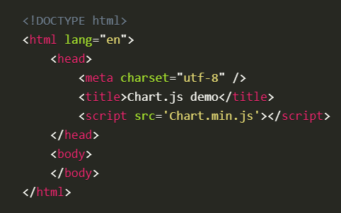

# Headings

### In this table, you will see codes of HTML:

|   HTML                                          |  Rendered Output                             |
|-------------------------------------------------|----------------------------------------------|
| < h1 > Heading < h1 >                           | <h1>Heading</h1>                             |
| < h2 > Heading < /h2 >                          | <h2>Heading</h2>                             |
| < h6 > Heading < /h6 >                          | <h6>Heading</h6>                             |
| < p > Paragraph < /p >                          | 
Paragraph
                             |
| < em > Italic < /p >                            | <em>Italic</em>                              |
| < strong >< em > Bold Italic < em >< strong >   | <strong><em> Bold Italic <em><strong>        |
| < ol >                                          | <ol>                                         |
| < li > First item < /li >                       | <li>First item</li>                          |
| < li > Second item < /li >                      | <li>second item</li>                         |
| < li > Third item < /li >                       | <li>Third item</li>                          |
| < li > Fourth item < /li >                      | <li>Fourth item</li>                         |
| < /ol >                                         | </ol>                                        | 
| < ul >                                          | <ul>                                         |
| < li > First item < /li >                       | <li>First item</li>                          | 
| < li > Second item < /li >                      | <li>Second item</li>                         |
| < li > Third item < /li >                       | <li>Third item</li>                          |
| < li > Fourth item < /li >                      | <li>Fourth item</il>                         |
| < /ul >                                         | </ul>                                        |
  

# In this section, we will look at how to make your web pages more attractive, controlling the design of them using CSS.

*CSS allows you to create rules that control the way that each individual box (and the contentsof that box) is presented.*
 
 

 # CSS works by associating rules with HTML elements. These rules govern how the content of specified elements should be displayed. A CSS rule contains two parts: a selector and a declaration.

# CSS Selectors

|   Selector                 |   Meaning                                |           Example                  |
|----------------------------|------------------------------------------|------------------------------------|
| Universal Selector         | Applies to all elements in the document  | * {}                               | |                            |                                          |  Targets all elements on the page  |
| Type Selector              | Matches element names                    | h1, h2, h3 {}                      |
| Class Selector             | Matches an element whose                 | Targets the < h1>, < h2> and< h3>  |
|                            | class attribute has a value that         | elements                           |
|                            | matches the one specified after          |.note {}                            |
|                            | the period (or full stop) symbol         | Targets any element whose class    |
|                            | the period (or full stop) symbol         | attribute has a value of note      |
|                            | id attribute has a value that            | p.note {}                          |
| ID Selector                | matches the one specified after          | #introduction {}                   |
|                            | the pound or hash symbol                 | Targets the element whose          |
| Child Selector             | Matches an element that is a             | id attribute has a value of        |
|                            | direct child of another                  | introduction                       |
| Descendant Selector        | Matches an element that is a             | li>a {} Targets any <a>            |
|                            | descendent of another specified          | elements that are children of an   |
|                            | element (not just a direct child of      | <li> element (but not other <a>    |
|                            | that element)                            | elements in the page)              |
| Adjacent Sibling Selector  | Matches an element that is the           | h1+p {} Targets the first 
      | 
|                            | next sibling of another                  | element after any <h1> element     |
|                            |                                          | (but not other 
 elements)       |
| General Sibling Selector   | Matches an element that is a             | h1~p {}                            |
|                            | sibling of another, although it          | If you had two 
 elements that   |
|                            | does not have to be the directly         | are siblings of an <h1> element,   |
|                            | preceding element                        | this rule would apply to both      |

# JAVASCRIPT

## How to declare variables

# Data type :

- Numeric data type : 0.75
- String data type  : " Hi, Ivy! "
- Bolean data type  : true,false

# Kinds of operators : 

- **assignment operators:**
(=,=+,-+,*+,/=,%=,**=)

- **String operators:** 
("",'', text+"text")

- **comparision operators:**
(==,===,!=,!==,>,<,>=,<=)

- **logical operators:**
I(&&,||)

  ## For more information vistit [w3schools](https://www.w3schools.com/)
