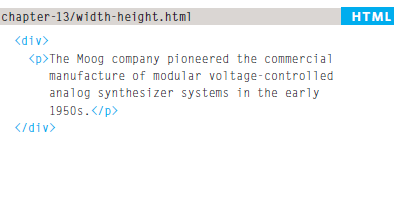
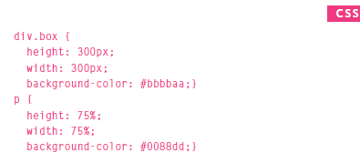
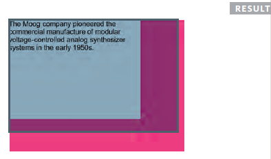
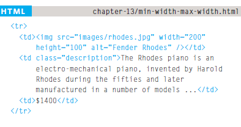
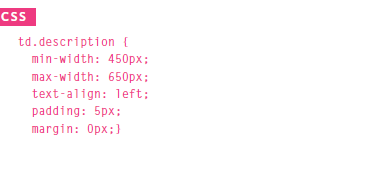
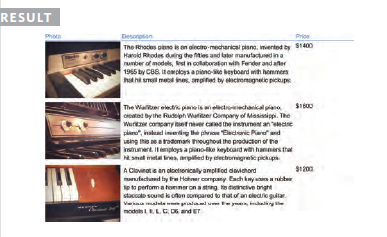
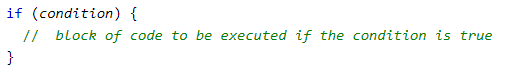
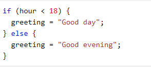
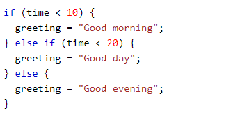

# HTML list

### *In this paragraph we will discuss HTML list :*

## - **Ordered lists:** are lists where each item in the list is numbered. For example, the list might be a set of steps for a recipe that must be performed in order, or a legal contract where each.

## ***For example:***

### **< ol>** The ordered list is created with the <ol> element.
### **< li>** Each item in the list is placed between an opening < li> tagand a closing < /li> tag. (The li stands for list item.)

## - **Unordered lists:** are lists that begin with a bullet point (rather than characters that indicate order).

### ***For example:***

### **< ul>** The unordered list is createdwith the < ul> element.
### **< li>** Each item in the list is placed between an opening < li> tag and a closing < /li> tag. (The li stands for list item.)

## - **Definition lists:** are made up of a set of terms along with the definitions for each of those terms.

### ***For example:***

### **< d1>** The definition list is created with the < dl> element and usually consists of a series of terms and their definitions.
### **< dt>** This is used to contain the term being defined (the definition term).
### **< dd>** This is used to contain the definition.

# Box Dimensions (width, height)

### The most popular ways to specify the size of a box are to use pixels, percentages, or ems. Traditionally, pixels have been the most popular method because they allow designers to accurately control their size.

      

# Limiting Width min-width, max-width

### Some page designs expand and shrink to fit the size of the user's screen. In such designs, the min-width property specifies the smallest size a box can be displayed at when the browserwindow is narrow, and the max-width property indicatesthe maximum width a box can stretch to when the browser window is wide.

       

# CREATING AN ARRAY

## **array literal**
### You create an array and give it a name just like you would any other variable (using the var keyword followed by the name of the array). The values are assigned to the array inside a pair of square brackets, and each value is separated by a comma. The values in the array do not need to be the same data type, so you can store a string, a number and a Boolean all in the same array.

## *For example* 

## *var colors;* colors=['white', 'black', ' custom '];*

## **array constructor.**
### This uses the new keyword followed by Array(); The va lues are then specified in parentheses (not square brackets), and each value is separated by a comma. You can also use a method called i tern() to retrieve data from the array. (The index number of the item is specified in the parentheses.)

## *For example*

## var colors=new Array('white ' ,

## 'black',

## 'custom ' );

## var el = document.getElementByid( ' co lors ' );

## el.innerHTML = colors.item(O);

## In JavaScript we have the following conditional statements:

## -*Use if to specify a block of code to be executed, if a specified condition is true*
## -*Use else to specify a block of code to be executed, if the same condition is false*
## -*Use else if to specify a new condition to test, if the first condition is false*
## -*Use switch to specify many alternative blocks of code to be executed*

# The JavaScript IF, Else Statement

# Syntax
   

# The JavaScript Switch Statement

# Syntax

[For more reading topics](https://github.com/sarahdagamseh/reading-notes201/tree/main)

&copy; Created By Sarah Dagamseh