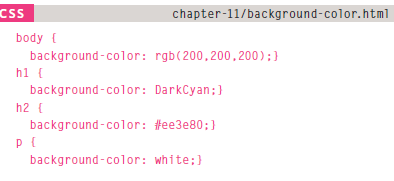
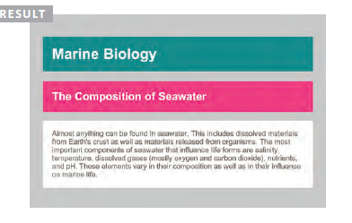
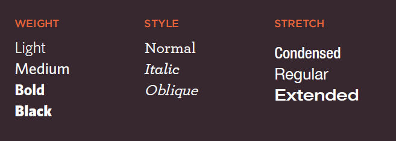
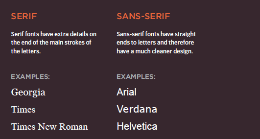
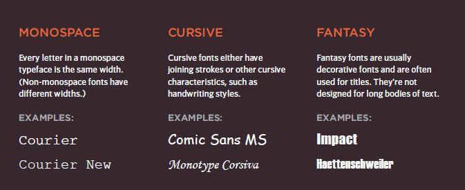

# Going deep in HTML 

## *Choosing Images for Your Site*
## A picture can say a thousand words, and great images help make the difference between an average-looking site and a really engaging one.

### *Images should...*
### - Be relevant
### - Convey information
### - Convey the right mood
### - Be instantly recognisable
### - Fit the color palette

### *Stock photos*
### - www .istockphoto.com
### - www .gettyimages.com
### - www .veer.com
### - www .sxc.hu
### - www .fotolia.com

### *Online extra*
### We have provided an online gallery that helps you choose the right image for your website. You can find it in the tools section ofthe site accompanying this book.

## *Storing Images onYour Site*
### all of the images are stored in a folder called imagesmimages such as logos and buttons might sit in a folder called interface, product photographs might sit in a page called products, and images related to news might live in a folder called news.

## *Adding Images*
## < img>
### *To add an image into the page you need to use an  element. This is an empty element (which means there is no closing tag). It must carry the following two attributes:

**src**
### This tells the browser where it can find the image file. This will usually be a relative URL pointing to an image on your own site. (Here you can see that the images are in a child folder called images.

**alt**
### This provides a text description of the image which describes the image if you cannot see it.

**title**
### You can also use the title attribute with the  element to provide additional information about the image. Most browsers will display the content of this attribute in a tootip when the user hovers over the image.

## *Height & Width of Images*
### *height*
### This specifies the height of the image in pixels.

### *width*
### This specifies the width of the image in pixels.

## *Foreground Color*
### These express colors in terms of how much red, green and blue are used to make it up. For example: rgb(100,100,90).

### *hex codes*
### These are six-digit codes that represent the amount of red, green and blue in a color,preceded by a pound or hash # sign. For example: #ee3e80.

## *color names*
### There are 147 predefined color names that are recognized by browsers. For example: DarkCyan.

    

## *Understanding Color*

### - RGB Values: Values for red, green, and blue are expressed as numbers between 0 and 255.
### *for example:* rgb(102,205,170)

### - Hex Codes: Hex values represent values for red, green, and blue.
### *for example:* #66cdaa

### - Color Names:Colors are represented by predefined names. However,  they are very limited in number.
### *for example:* MediumAquaMarine

### - Hue:Hue is near to the colloquial idea of color. Technically speaking however, a color can also have saturation and brightness as well as hue.

### - Saturation:Saturation refers to the amount of gray in a color. At maximum saturation, there would be no gray in the color. At minimum saturation, the color would be mostly gray.

### - Brightness:Brightness (or "value") refers to how much black is in a color. At maximum brightness, there would be no black in the color. At minimum brightness, the color would be very dark.

# Typeface Terminology

### - Serif 

### - Sans-Serif 

### - Monospace  

## The xyz

 
 

### - For more information [visit](https://blog.imagekit.io/jpeg-vs-png-vs-gif-which-image-format-to-use-and-when-c8913ae3e01d)