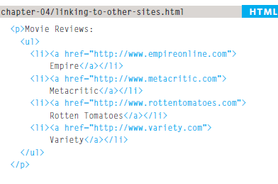
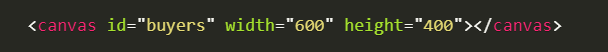
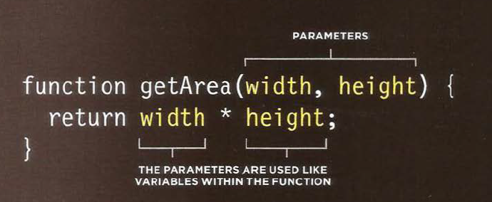
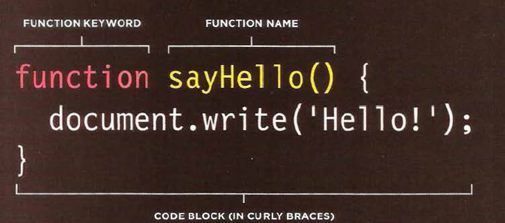

# Creating links between pages
# Linking to other sites
# Email links

### **absolute URL**
### When you link to a different website, the value of the href attribute will be the full web address for the site.

# Linking to Other Sites

# HTML

# Result

Movie Reviews:
<ul>
<li><a href="http://www.empireonline.com">
Empire</a></li>
<li><a href="http://www.metacritic.com">
Metacritic</a></li>
<li><a href="http://www.rottentomatoes.com">
Rotten Tomatoes</a></li>
<li><a href="http://www.variety.com">
Variety</a></li>
</ul>

S

# Linking to Other Pages on the Sa me Site

### **relative URL**
### When you are linking to other pages within the same site, you do not need to specify the domain name in the URL (short hand).

# HTML 

# Result

<ul>
<li><a href="index.html">Home</a></li>
<li><a href="about-us.html">About</a></li>
<li><a href="movies.html">Movies</a></li>
<li><a href="contact.html">Contact</a></li>
</ul>

# Directory Structure

### - *Structure*
### The diagram on the right shows the directory structure for a fictional entertainment listings website called ExampleArts. The top-level folder is known as the root folder.
### - *Relationships*
### The relationship between files and folders on a website is described using the same terminology as a family tree, The examplearts folder is a parent of the movies, music and theater folders. And the the movies, music and theater folders are children of the examplearts folder.
### - *Homepages*
### The main homepage of a site written in HTML (and the  homepages of each section in a child folder) is called index.html.

# Key Concepts in Positioning Elements

### *Building Blocks*
### CSS treats each HTML element as if it is in its own box. This box will either be a block-level box or an inline box.

### *Containing Elements*
### If one block-level element sits inside another block-level element then the outer box is known as the containing or parent element.

# Controll ing the Position of Elements

### ***positioning schemes*** that allow you to control the layout of a page: normal flow, relative positioning, and absolute positioning. You specify the positioning scheme using the position property in CSS. You can also float elements using the float property.

### - Normal flow
### - Relative Positioning
### - Ab solute positioning

# WHAT IS A FUNCTION?
### **Functions** let you group a series of statements together to perform a pecific task. If different parts of a script repeat the same task, you can reuse the function (rather than repeating the same set of st atements).

### - *calling* If you are going to ask the function to perform its task later, you need to give your function a name. That name should describe the task it is performing. When you ask it to perform its task.
### - *parameters* Some functions need to be provided with information in order to achieve a given task. For example, a function to calculate the area of a box would need to know its width and height.

### - *return value* When you write a function and you expect it to provide you with an answer.

# Basic Function

# Declaring a function

# Calling function
!(calling)[s.PNG]

# 6 Reasons for Pair Programming

## - Greater efficiency
## - Engaged collaboration
## - Learning from fellow students
## - Social skills
## - Job interview readiness
## - Work environment readiness

### *For more info* [visit](https://www.codefellows.org/blog/6-reasons-for-pair-programming/)

&copy; By Sarah Dagamseh
>>>>>>> 665362223e911f1e1a52ed2546412dd7731c8d28
