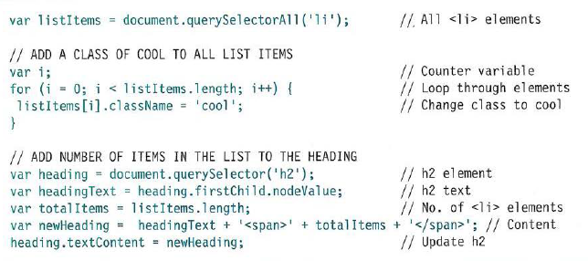

# WHAT IS AN OBJECT?

## *Objects group together a set of variables and functions to create a model of a something you would recognize from the real world. In an object, variables and functions take on new names.*

### *PROPERTY*

### Properties te ll us about the object, such as the name of a hotel or the number of rooms it has. Each individual hotel might have a different name and a different number of rooms

### *METHOD*

### Methods represent tasks that are associated with the object. For example, you can check how many rooms are available by subtracting the number of booked rooms from the total number of rooms

### *KEY*

### Like variables and named functions, properties and methods have a name and a va lue. In an object

# NODELISTS: DOM QUERIES THAT RETURN MORE THAN ONE ELEMENT

### *A Nodelist is a collection of element nodes. Each node is given an index number (a number that starts at zero, just like an array).*

### Nodelists look like arrays and are numbered like arrays, but they are not ac tually arrays; they are a type of object called a ***collection.***

### LIVE & STATIC NODELISTS

### ***live Nodelist*** when your script updates the page, the Nodelist is updated at the same time. The methods beginning getEl ementsBy_ return live Node lists. They are also typically faster to generate than static Nodelists

### ***static Nodelist*** when your script updates the page, the NodeList is not updated to reflect the changes made by the script.

## getElementsByTagName('hl ' )         

## getElementsByTagName('li ')          

## getElementsByClassName('hot')        

## querySe l ectorA 11 ( ' l i [id] ' ) 

# Syntax Array

# ***SELECTING ELEMENTS USING CLASS ATTRIBUTES***
  

# ***SELECTING ELEMENTS BY TAG NAME***

# ***SELECTING ELEMENTS USING CSS SELECTORS***
 

# LOOPING THROUGHA NODELIST

### *for more information about JS Object Literals & Document Object Model read javascript_and_jquery_interactive_jon_du (1)*

&copy; By Sarah Dagamseh

