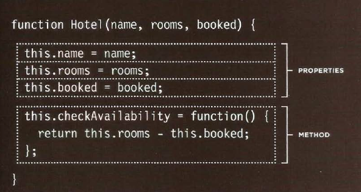

# What's a Table?

### A table represents information in a grid format. Examples of tables include financial reports, TV schedules, and sports results.

### Basic Table Structure
### < table>
### The < table> element is used to create a table. The contents of the table are written out row by row.

### < tr>
### You indicate the start of each row using the opening <tr> tag. (The tr stands for table row.) It is followed by one or more <td> elements (one for each cell in that row). At the end of the row you use a closing </ tr> tag.

### < td>
### Each cell of a table is represented using a < td> element. (The td stands for table data.) At the end of each cell you use a closing </ td> tag.

## *Table Headings*
### The < th> element is used just like the <td> element but its
### the heading for either a column or a row. (The th stands for table heading.)

## *Spanning ColumnS*
### The colspan attribute can be used on a < th> or < td> element and indicates how many columns that cell should run across.

## *Spanning Row*
### The rowspan attribute can be used on a <th> or <td> element to indicate how many rows a cell should span down the table.

## *Long Tables*
### There are three elements that help distinguish between the main content of the table and the first and last rows (which can contain different content).

### - **< thead>**
### The headings of the table should sit inside the <thead> element.

### - **< tbody>**
### The body should sit inside the < tbody> element.

### - **< tfoot>**
### The footer belongs inside the < tfoot> element.

## **Old Code: Width & Spacing**

 

## **Old Code: Border & Background**

# Creating an Object

# Updating an Object

OR 

# CREATING MANY OBJECTS: CONSTRUCTOR NOTATION

# CREATING OBJECTS USING CONSTRUCTOR SYNTAX

&Copy By Sarah Dagamseh