# LAYOUT
### In this chapter we are going to look at how to control where each element sits on a page and how to create attractive page layouts.

## **Normal Flow position:static**
### In normal flow, each block-level element sits on top of the next one. Since this is the default way in which browsers treat HTML elements, you do not need a CSS property to indicate that elements should appear in normal flow, but the syntax would be: position: static;

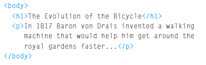 
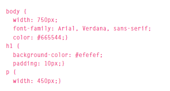  
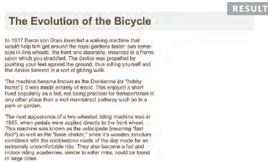

## **Relative Positioning position:relative**
### Relative positioning moves an element in relation to where it would have been in normal flow. For example, you can move it 10 pixels lower than it would have been in normal flow or 20% to the right. You can indicate that an element should be relatively positioned using the position property with a value of relative.

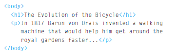 
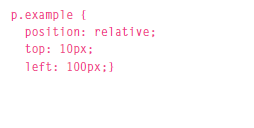 
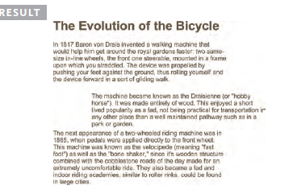

## **Absolute Positioning position:absolute**
### When the position property is given a value of absolute, the box is taken out of normal flow and no longer affects the position of other elements on the page. (They act like it is not there.) The box offset properties (top or bottom and left or right) specify where the element should appear in relation to its containing element.

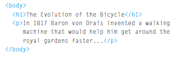  
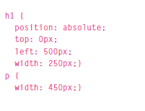  
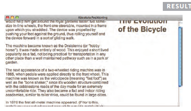

# **Fixed Positioning position:fixed**
### Fixed positioning is a type of absolute positioning that requires the position property to have a value of fixed. It positions the element in relation to the browser window. Therefore, when a user scrolls down the page, it stays in the exact same place. It is a good idea to try this example in your browser to see the effect.

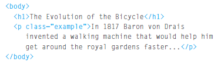
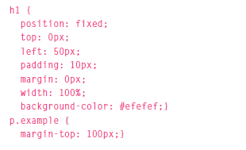
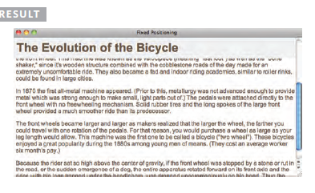

# **Overlapping Elements z-index**
### The z-index is sometimes referred to as the stacking context (as if the blocks have been stacked on top of each other on a z axis). If you are familiar with desktop publishing packages, it is the equivalent of using the 'bring to front' and 'send to back' features.

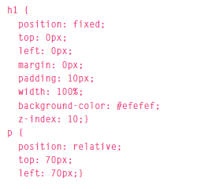
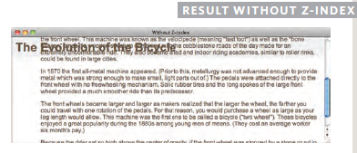
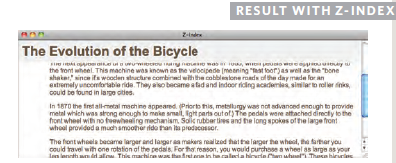

&copy; By Sarah Dagamseh