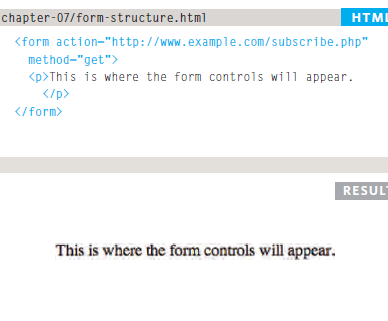
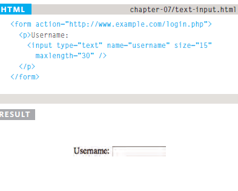
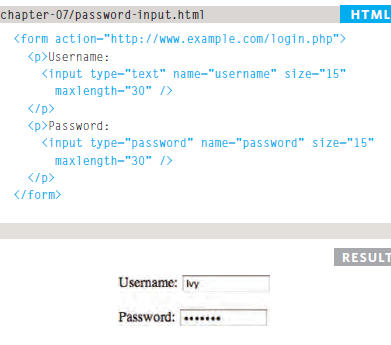
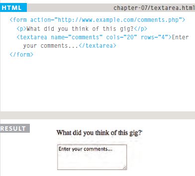
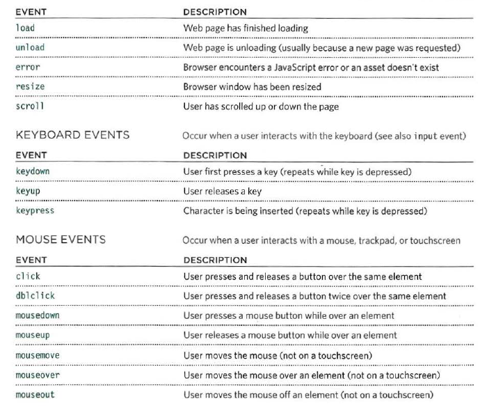
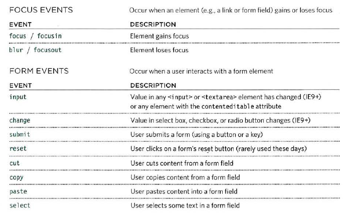
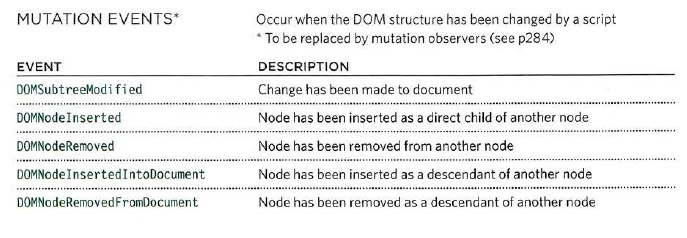

# Form Structure
## **action** Every < form> element requires an action attribute. Its value is the URL for the page on the server that will receive the information in the form when it is submitted.

## **method** Forms can be sent using one of two methods: get or post. With the get method, the values from the form are added to the end of the URL specified in the action attribute. The get method is ideal for:
## - short forms (such as search boxes).
## - when you are just retrieving data from the web server (not sending information that should be added to or deleted from a database).

## **id** We look at the id attribute on page 183, but the value is used to identify the form distinctly from other elements on the page (and is often used by scripts — such as those that check you have entered information into fields that require values).

# Text Input
## **type="text"** When the type attribute has a value of text, it creates a singleline text input.
# **name** When users enter information into a form, the server needs to know which form control each piece of data was entered into. (For example, in a login form, the server needs to know what has been entered as the username and what has been given as the password.) Therefore, each form control requires a name attribute. The value of this attribute identifies the form control and is sent along with the information they enter to the server.
## **maxlength** You can use the maxlength attribute to limit the number of characters a user may enter into the text field. Its value is the number of characters they may enter. For example, if you were asking for a year, the maxlength attribute could have a value of 4.

## **size** The size attribute should not be used on new forms. It was used in older forms to indicate the width of the text input (measured by the number of characters that would be seen).

# Password Input

## **type="password"**When the type attribute has a value of password it creates a text box that acts just like a single-line text input, except the characters are blocked out. They are hidden in this way so that if someone is looking over the user's shoulder, they cannot see sensitive data such as passwords.

# Text area
### The < textarea> element is used to create a mutli-line text input. Unlike other input elements this is not an empty element. It should therefore have an opening and a closing tag. Any text that appears between the opening < textarea> and closing </ textarea> tags will appear in the text box when the page loads.

# Bullet Point Style (list-style-type)
### The list-style-type property allows you to control the shape or style of a bullet point (also known as a marker).
### **Unordered Lists**
## for an unordered list you can usethe following values:
## - none
## - disc
## - circle
## - square
### **Ordered Lists**
## For an ordered (numbered) list you can use the following values:
### **decimal**
### 1 2 3
### **decimal-leading-zero**
### 01 02 03
### **lower-alpha**
### a b c
### **upper-alpha**
### A B C
### **lower-roman**
### i. ii. iii.
### **upper-roman**
### | || |||

# Images for bullet (list-style-image)
### You can specify an image to act as a bullet point using the list-style-image property. The value starts with the letters url and is followed by a pair of parentheses. Inside the parentheses, the path to the image is given inside double quotes. This property can be used on rules that apply to the <ul> and < li> elements.

# Event
## DIFFERENT EVENT TYPES

# TERMINOLOGY
## EVENTS FIRE OR ARE RAISED
### When an event has occurred, it is often described as having fired or been raised. In the diagram on the right, if the user is tapping on a link, a click event would fire in the browser. EVENTS TRIGGER SCRIPTS Events are said to t rigger a function or script. When the click event fires on the element in this diagram, it could trigger a script that enlarges the selected item.

## HOW EVENTS TRIGGER JAVASCRIPT CODE:
### 1- select the element node(s) you want the script to respond to.
### 2- Indicate which event on the selected node(s) will trigger the response.
### 3- State the code you want to run when the event occurs.

&copy; By Sarah Dagamseh