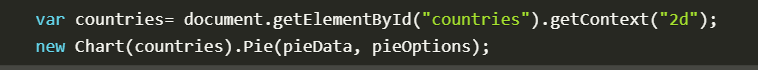

# CREATE STUNNING ANIMATED CHARTS WITH CHART.JS
## **Setting up**

## **Drawing a line chart**

## **Drawing a pie chart**

## **Drawing a bar chart** 

# Basic usage of canvas

## **The < canvas> element**
### At first sight a < canvas> looks like the < img> element, with the only clear difference being that it doesn't have the src and alt attributes. Indeed, the < canvas> element has only two attributes, width and height. These are both optional and can also be set using DOM properties. When no width and height attributes are specified, the canvas will initially be 300 pixels wide and 150 pixels high. The element can be sized arbitrarily by CSS, but during rendering the image is scaled to fit its layout size: if the CSS sizing doesn't respect the ratio of the initial canvas, it will appear distorted.

## **Fallback content**
### The <canvas> element differs from an < img> tag in that, like for <video>, < audio>, or < picture> elements, it is easy to define some fallback content, to be displayed in older browsers not supporting it, like versions of Internet Explorer earlier than version 9 or textual browsers. You should always provide fallback content to be displayed by those browsers.

## **Required </ canvas> tag**
### As a consequence of the way fallback is provided, unlike the < img> element, the < canvas> element requires the closing tag (<  canvas>). If this tag is not present, the rest of the document would be considered the fallback content and wouldn't be displayed.

## **The rendering context**
