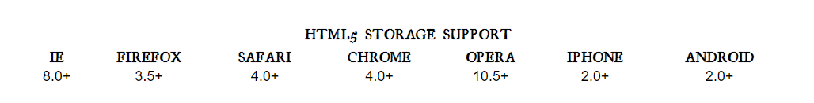
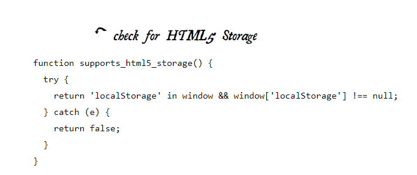
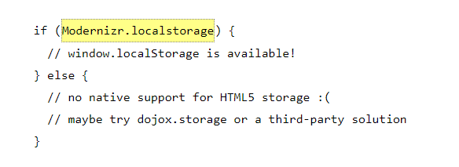
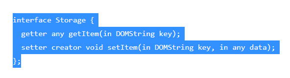
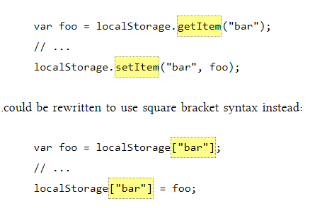
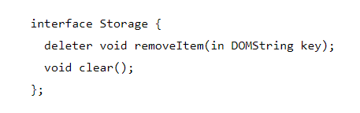
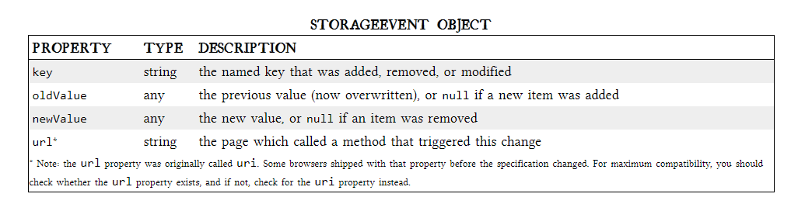
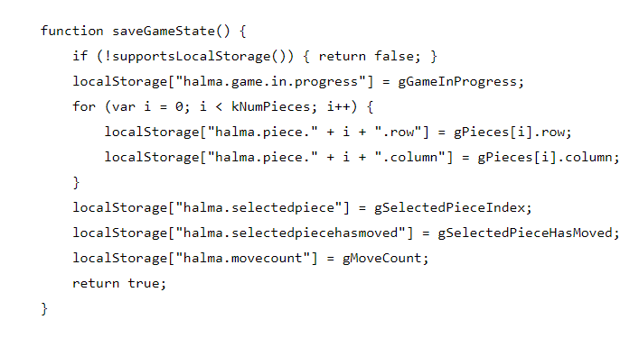

# INTRODUCING HTML5 STORAGE 

### What I will refer to as “HTML5 Storage” is a specification named Web Storage, which was at one time part of the HTML5 specification proper, but was split out into its own specification for uninteresting political reasons. Certain browser vendors also refer to it as “Local Storage” or “DOM Storage.” The naming situation is made even more complicated by some related, similarly-named, emerging standards that I’ll discuss later in this chapter.

### **Which browsers? Well, the latest version of pretty much every browser supports HTML5 Storage… even Internet Explorer!**

### **Which browsers? Well, the latest version of pretty much every browser supports HTML5 Storage… even Internet Explorer!**

# USING HTML5 STORAGE

### HTML5 Storage is based on named key/value pairs. You store data based on a named key, then you can retrieve that data with the same key. The named key is a string. The data can be any type supported by JavaScript, including strings, Booleans, integers, or floats. However, the data is actually stored as a string. If you are storing and retrieving anything other than strings, you will need to use functions like parseInt() or parseFloat() to coerce your retrieved data into the expected JavaScript datatype.

### **There are also methods for removing the value for a given named key, and clearing the entire storage area (that is, deleting all the keys and values at once).**

# TRACKING CHANGES TO THE HTML5 STORAGE AREA

### If you want to keep track programmatically of when the storage area changes, you can trap the storage event. The storage event is fired on the window object whenever setItem(), removeItem(), or clear() is called and actually changes something. For example, if you set an item to its existing value or call clear() when there are no named keys, the storage event will not fire, because nothing actually changed in the storage area.

# HTML5 STORAGE IN ACTION

### Let’s see HTML5 Storage in action. Recall the Halma game we constructed in the canvas chapter. There’s a small problem with the game: if you close the browser window mid-game, you’ll lose your progress. But with HTML5 Storage, we can save the progress locally, within the browser itself. Here is a live demonstration. Make a few moves, then close the browser tab, then re-open it. If your browser supports HTML5 Storage, the demonstration page should magically remember your exact position within the game, including the number of moves you’ve made, the position of each of the pieces on the board, and even whether a particular piece is selected.

