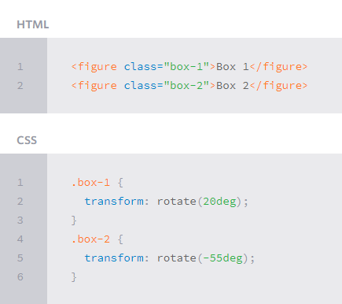
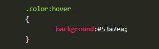

# Transforms
## *Transform Syntax*

## *2D Transforms*
### Elements may be distorted, or transformed, on both a two-dimensional plane or a three-dimensional plane. Two-dimensional transforms work on the x and y axes, known as horizontal and vertical axes. Three-dimensional transforms work on both the x and y axes, as well as the z axis. These three-dimensional transforms help define not only the length and width of an element, but also the depth. We’ll start by discussing how to transform elements on a two-dimensional plane, and then work our way into three-dimensional transforms.

## **2D Rotate**

## **2D Scale**

# Transitions & Animations
### One evolution with CSS3 was the ability to write behaviors for transitions and animations. Front end developers have been asking for the ability to design these interactions within HTML and CSS, without the use of JavaScript or Flash, for years. Now their wish has come true.

## **Transitions**
### As mentioned, for a transition to take place, an element must have a change in state, and different styles must be identified for each state. The easiest way for determining styles for different states is by using the :hover, :focus, :active, and :target pseudo-classes.

# 8 SIMPLE CSS3 TRANSITIONS THAT WILL WOW YOUR USERS

## **1. Fade in**

## **2. Change color**

## **3. Grow & Shrink**

## **4. Rotate elements**

## **5. Square to circle**

## **6. 3D shadow**

## **7. Swing**

## **8. Inset border**

