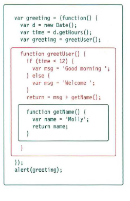

# EXECUTION CONTEXT & HOISTING

## 1: PREPARE

### - • The new scope is created
### - • Variables, functions, and arguments are created
### - • The value of the this keyword is determined

## 2: EXECUTE
### - • Now it can assign values to variables
### - • Reference functions and run their code
### - • Execute statements

# UNDERSTANDING SCOPE
## In the interpreter, each execution context has its own va ri ables object. It holds the variables, functions, and parameters available within it. Each execution context can also access its parent's v a ri ables object.

# UNDERSTANDING ERRORS
## If a JavaScript statement generates an error, then it throws an exception. At that point, the interpreter stops and looks for exception-handling code.

# ERROR OBJECTS
## Error objects can help you find where your mistakes are and browsers have tools to help you read them.

# ERROR OBJECTS CONTINUED
## Please note that these error messages are from the Chrome browser. Other browsers' error messages may vary.

