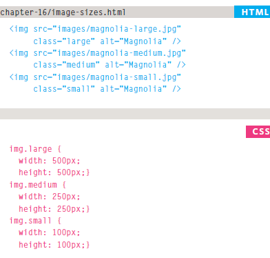
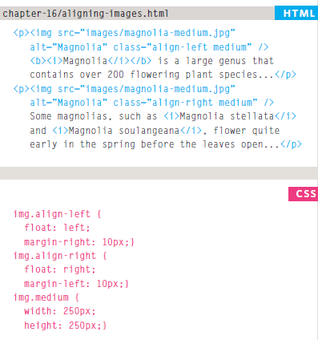
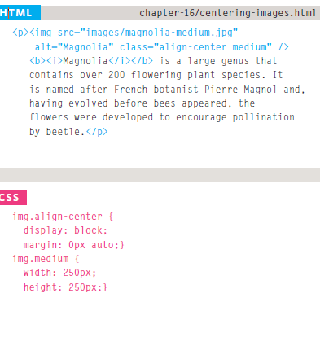

# Controlling sized of images in CSS
### You can control the size of an image using the width and height properties in CSS, just like you can for any other box.

# AligNi ng images Using CSS
### In the last chapter, you saw how the float property can be used to move an element to the left or the right of its containing block, allowing text to flow around it.

# Centering images Using CSS
### By default, images are inline elements. This means that they flow within the surrounding text. In order to center an image, it should be turned into a blocklevel element using the display property with a value of block.

